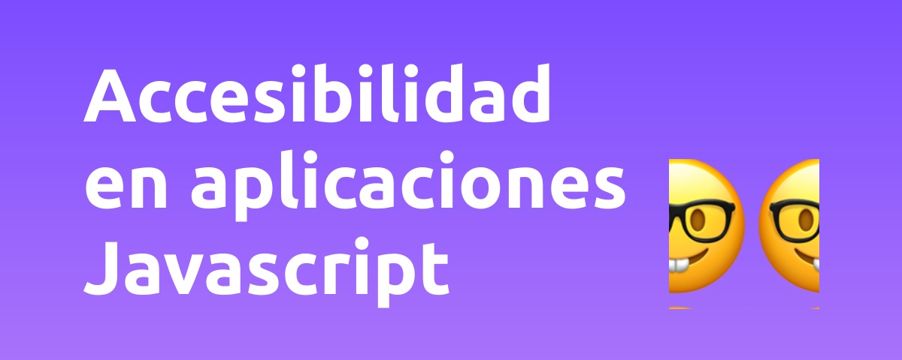

# Accesibilidad en aplicaciones Javascript ♿️ 💻



## Bienvenido a un nuevo workshop de Escuela Frontend 👋.

El objetivo de este workshop es proporcionar las herramientas fundamentales para aprender a crear aplicaciones web accesibles. Este repositorio está compuesto de 14 lecciones con ejercicios prácticos que te ayudarán a afianzar los conocimientos vistos en cada módulo.

No pierdas la oportunidad de aprender uno de los skills más solicitados en la industria web y súmate a esta experiencia 💪.

## Prerrequisitos

- [Conocimientos básicos de Desarrollo Web](https://blog.teo-garcia.dev/que-demonios-es-desarrollo-web)
- [Conocimientos básicos de React](https://www.escuelafrontend.com/cursos/curso-practico-de-react)

## Requerimientos de sistema

- [Node](https://nodejs.org/) `>= 14`
- [Git](https://git-scm.com/) `>= 2.13`
- [VSCode](https://code.visualstudio.com/) `>= 1.4`

Puedes hacer un checkeo básico de estas herramientas usando la terminal:

```bash
  echo "\n\nNode version:" && node --version
  echo "\n\nGit version:" && git --version
  echo "\n\nVSCode version:" && code --version
```

## Instalación

1. Clona el repositorio ejecutando el siguiente comando:

  ```bash
    git clone https://github.com/escuela-frontend/accesibilidad-en-aplicaciones-javascript
  ```
2. Instala el proyecto usando el siguiente comando:

  ```bash
    cd accesibilidad-en-aplicaciones-javascript && npm i
  ```

3. Abre el repositorio haciendo uso de VSCode:

```bash
  code .
```

4. Dale un vistazo a la [distribución del workshop](#distribución-del-workshop) y prepárate para aprender sobre accesibilidad web 🤘.

## Distribución del workshop

Este workshop esta dividido en 14 lecciones, cada una de ellas contiene un pequeño proyecto de React en el que encontraras:

- `NUMERO.md`: El contenido de la lección, snippets de código de ejemplo, metas y descripción del reto a desarrollar.
- `NUMERO.jsx`: El componente donde está ubicado el reto. Sigue las pistas que te susurran los emojis para solucionar el reto.
- `NUMERO.solution.jsx`: El componente con la solución del reto.
- `NUMERO.extra.NUMERO.jsx`: El componente con la solución del Crédito Extra. Intenta no ver ninguno de estos dos archivo hasta que hayas terminado o no tengas idea de como continuar.
- `NUMERO.css`: Los estilos asociados a `NUMERO.jsx`. Solo debes usarlos cuando el reto este relacionado con CSS accesible.

## Sigue las pistas 🟣 🟡 🟢 🔴

En cada reto encontrarás pistas y sugerencias que nuestros amigos han dejado para ayudarte a solucionar cada uno de los problemas. Identifica a tus amigos y entiende cual es su función en este workshop:


| **Color** | **Descripción**|
|:---------:|----------------------------------------------------------------------|
| 🟣 | Inspecciona usando herramientas de desarrollo y/o tu intuición |
| 🟡 | Modifica los elementos mencionados |
| 🟢 | Agrega código que siga las sugerencias |
| 🔴 | Elimina el código que esta causando el problema|

## Acerca de mi 👋


Mi nombre es Mateo Garcia, soy un Frontend Developer establecido en Medellin, Colombia 🇨🇴. He estado en la industria del desarrollo desde hace más de 8 años y se que aprender cosas nuevas puede resultar complicado en ocasiones. Mi tarea aquí es ayudarte a dominar los aspectos principales del desarrollo de aplicaciones web accesibles y construir juntos el mejor workshop de accesibilidad de habla hispana.

### Donde encontrarme 🔍

- [Twitter](https://twitter.com/_teo_garcia)

- [Github](https://github.com/teo-garcia)

- [LinkedIn](https://www.linkedin.com/in/teogarcia0)