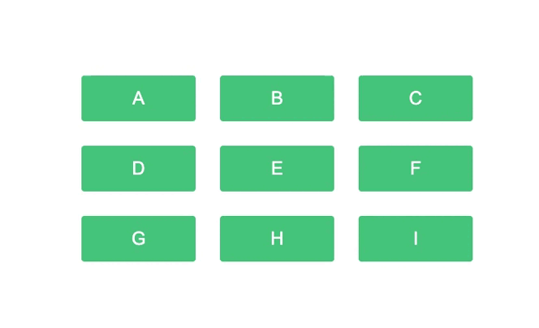

# CSS Accesible: Estilo del foco

## Tus apuntes ✏️

Puedes usar este espacio para apuntar tus aprendizajes de esta lección.


## Outline

Uno de los elementos que facilitan la navegación sin el uso del mouse es el estilo del foco. El `outline` es una linea por fuera del borde que heredan por defecto los elementos enfocables, el proposito de esto es funcionar como un `indicador de enfoque` para que los usuarios que navegan sin un mouse identifiquen donde están.




El principal aprendizaje de esta lección es que nunca elimines el estilo del foco, al hacerlo arruinas la experiencia de las personas que no usan un mouse, sea por discapacidades visuales (parciales) o discapacidades motoras.

```css
  button {
    outline: none; /* No hagas esto! ❌ */
  }

  input {
    outline: none; /* Esto menos! ❌ */
  }

  a {
    outline: none; /* Tampoco! ❌ */
  }
```

Si estás trabajando en un proyecto profesional discute con los UI y UX las maneras mas adecuadas para modificar los estilos de este indicador, ten en cuenta algunas consideraciones de la WCAG:

- Asegurarse que la relación de contraste entre el `outline-color` y el `background-color` del exterior esté por encima del mínimo (4.5 : 1). ✅
- Verificar también que la relación de contraste entre el `outline-color` y el `background-color` de los elementos adyacentes esté por encima del mínimo (3 : 1). ✅

## Pongámoslo a prueba 💪

### Objetivos 🎯
- Entender como navegan las personas con visión reducida o problemas de motricidad.
- Conocer el estilo que le indica a los usuarios su posición en la página al usar el teclado.
- Configurar adecuadamente los estilos teniendo en cuenta el `outline`.

### Ejercicios 💻

1. Navega por el formulario usando sol el teclado, identifica porque es dificil entender en que campo estas.
2. Inspeccionemos el código y encontremos el problema por el que no podemos navegar fácilmente con el teclado.


#### Crédito Extra 01 👑

Ahora que descubrimos el problema, navegar a través del teclado es mucho más fácil, sin embargo, el contraste entre el `background` de los controles y su `outline` no es el mejor. Modifica el color del `outline` para que cumpla con la especificación de la WCAG (3 : 1).