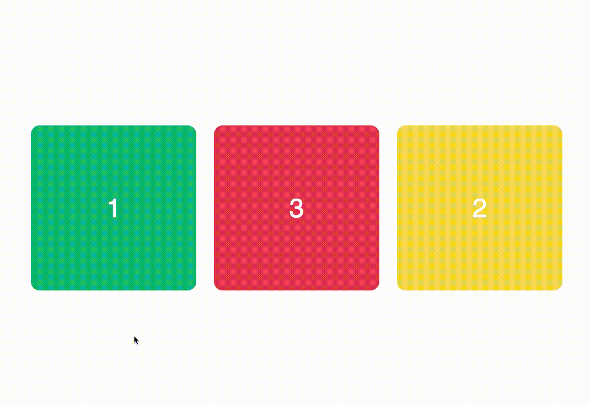

# CSS Accesible: Responsive Web Design

## Tus apuntes ✏️

Puedes usar este espacio para apuntar tus aprendizajes de esta lección.

## Outline

El diseño web responsivo (RWD) habilita la compatibilidad de los sitio web con millones de dispositivos. Ademas de esto, también puede mejorar la accesibilidad de tu sitio, aquí tenemos algunos aspectos importantes en el diseño web accesible:

### No deshabilites el zoom

Deshabilitar el zoom en los dispositivos móviles es uno de los anti-patrones menos conocidos en accesibilidad web. Es posible deshabilitar el zoom en los dispositivos móviles usando la propiedad `user-scalable="no"` en la etiqueta `<meta name="viewport" ...> `, sin embargo, esto resulta negativo para los usuarios que dependen del aumento de la pantalla para ver el contenido de la página.


```html
  <meta name="viewport" content="width=device-width, initial-scale=1.0, user-scalable=no"> <!-- No incluyas la propiedad user-scalable=no 🔴 -->
```

### Unidades relativas & tipografía


Como lo vimos en la primera lección de este módulo, algunos navegadores permiten modificar el tamaño base de la tipografía beneficiando a los usuarios que les cuesta ver el contenido de texto pequeño. En esta lección es importante recordarlo ya que los navegadores móviles también cuentan con esta funcionalidad y si usas unidades de tamaño absolutas como `px`, cambiar el tamaño base de texto no tendrá ningún efecto. 

Si combinas: 

- Tamaño de tipografía pequeño (Por debajo de los 14px). 🔴
- Deshabilitar el zoom. 🔴
- Uso de `px` en el tamaño de los textos. 🔴

Obtienes como resultado un sitio inaccesible para personas con visibilidad reducida. ♿️ ❌


### Controles táctiles accesibles

Cuando estés desarrollando sitios en version móvil asegúrate de que los controles (botones, links, inputs) sean lo suficientemente grandes y separados para evitar seleccionar los equivocados. Algunos expertos recomiendan que los elementos táctiles sean de por lo menos 48px.


### El orden en CSS

Cambiar el orden de los elementos es algo fácil de hacer usando `display: flex;` y `display: grid;`. Debemos asegurarnos que el orden de enfoque de los elementos sea lógico y asi evitar que los usuarios pierdan la conexión visual sobre lo que esta definido en el markup.




## Pongámoslo a prueba 💪

### Objetivos 🎯
- Descubrir los aportes del RWD en materia de accesibilidad web.
- Analizar como los usuarios con visión reducida adaptan los sitios a sus necesidades.
- Conocer algunos de los anti-patrones de diseño que afectan a los usuarios con discapacidades cognitivas y motoras.

### Ejercicios 💻

1. Ejecuta esta lección y ábrela desde el navegador de tu teléfono copiando la IP que está en la consola (asegúrate que la PC y el teléfono estén en la misma red).
2. Identifica los problemas a los que se enfrentaría un usuario con discapacidad visual usando este proyecto.
3. Habilita el zoom, visitando el archivo `index.html` y eliminando la propiedad `user-scalable=no` de la etiqueta `<meta name="viewport" ... />`.
4. Reemplaza las unidades de texto absolutas (`font-size: xxpx;`) por unidades relativas (`font-size: x.xrem;`).
5. Identifica los problemas a los que se enfrentaría un usuario con discapacidades motoras usando este proyecto.
6. Aumenta el tamaño de los iconos de redes sociales en el apartado de `footer`, el tamaño minimo es `48px`, si no quieres que los iconos tengan este tamaño puedes completarlo usando `padding`. 
7. Realiza una inspección usando la navegación con tabs y descubre las inconsistencias en el orden del foco.
8. Deshazte de las propiedades de CSS que establecen un orden diferente al establecido en el markup y que pueden confundir al usuario.