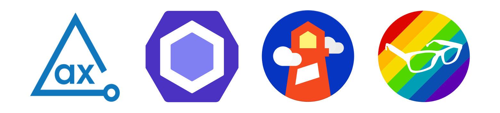

# Testing & Auditing: DevTools

## Tus apuntes ✏️

Puedes usar este espacio para apuntar tus aprendizajes de esta lección.


## Outline



Los proyectos tienden a crecer rápidamente con la llegada de nuevas funcionalidades y miembros al equipo. Introducir problemas de accesibilidad es más sencillo de lo que parece, por lo que encontrar y reparar estos problemas tan pronto como sea posible es la mejor decisión.

Existen herramientas que permiten identificar problemas de accesibilidad desde la etapa de desarrollo, es importante mencionar que no son la fuente de verdad absoluta y solo realizan un análisis estatico de la funcionalidad.

### ESLint

ESLint es lo que se conoce como un `linter` para Javascript; Con base en un conjunto de reglas/plugins determina si el código de tu proyecto cumple con las condiciones establecidas.

El plugin que veremos en está lección es [eslint-plugin-jsx-a11y](https://www.npmjs.com/package/eslint-plugin-jsx-a11y), gracias a el podremos analizar los problemas de accesibilidad en la creación de aplicaciones React.

#### Instalando `ESLint`:

1. Instalar el plugin de `ESLint` desde el apartado de extensiones en VSCode.
2. Desde esta lección ejecutar en la terminal `npm i eslint eslint-plugin-react eslint-plugin-jsx-a11y @typescript-eslint/parser -D`
3. Crear un archivo `.eslintrc.js` con el siguiente contenido:

```js
module.exports = {
  parser: '@typescript-eslint/parser',
  env: {
    browser: true,
    amd: true,
    node: true,
  },
  extends: [
    'eslint:recommended',
    'plugin:react/recommended',
    'plugin:jsx-a11y/recommended',
  ],
  rules: {
    'react/react-in-jsx-scope': 'off',
    'react/prop-types': 'off',
  },
};
```

### Axe & Axe Linter

Axe es un conjunto de soluciones que ayudan a mejorar el ecosistema de las aplicaciones web accesibles. Estás son algunas de sus herramientas más populares

- Axe Browser Extension
- Axe Linter
- Jest Axe
- Cypress Axe
- Axe React

A través de un [conjunto de reglas](https://dequeuniversity.com/rules/axe/4.4/) analizan el contenido renderizado y encuentran problemas asociados a la accesibilidad del sitio/aplicación.

En esta lección hablaremos de Axe Linter y Axe React, otra extensión similar a ESLint dedicada a la busqueda y solución de problemas de accesibilidad.

#### Instalando `axe linter`

Empezar a usar este `linter` es muy fácil, dirígete al apartado de extenciones de `VSCode` e instala el siguiente plugin `axe Acessibility Linter`.

#### Instalando `axe react`

Para empezar a usar `axe react`:

1. Desde esta lección ejecuta en la terminal `npm i @axe-core/react -D`
2. En el archivo principal de tu aplicación (en este caso `main.jsx`), agregar este fragmento de código:

```js
import axe from "@axe-core/react"
// ...
// ...
axe(React, ReactDOM, 1000);
```

3. Abre la consola del inspector y verifique que `Axe` este funcionando.

### Lighthouse CLI

Lighthouse es una herramienta gratuita creada por el equipo de Google, la cual nos permite auditar la calidad de nuestro sitio en diferentes aspectos como accesibilidad, performance, buenas practicas, entre otras. Por defecto, viene incorporada en el panel de desarrollador de Chrome por lo que es posible recibir reportes y mejorar la salud de nuestro sitio rápidamente.

#### Ejecutando Lighthouse desde el CLI

En está lección aprenderemos como obtener reportes de accesibilidad rápidamente en nuestro ambiente local, para empezar a usar `Lighthouse`:

1. Desde está lección ejecutar en la terminal `npm i lighthouse -D`
2. Dentro del `package.json` en el apartado de `scripts`, agregar la siguiente linea: 
`"test:lighthouse": "npx lighthouse http://localhost:3000 --only-categories accessibility --output-path='./assets/accessibility_report.html' --chrome-flags='--headless' --quiet --view"`.
3. Ejecutar el script agregado usando `npm run test:lighthouse`

El navegador generará un reporte en el cual podemos ver tips y sugerencias para mejorar el puntaje, en este caso en accesibilidad.

### Tota11y

Tota11y es un kit de herramientas de visualización de accesibilidad desarrollado por el equipo de Khan Academy. Nos ayuda a entender la manera en que las tecnologías asistivas intepretan nuestro sitio y cuenta con funcionalidades como:

- Listado de encabezados.
- Contraste de los texots.
- Configuración de los formularios.
- Detector de alt texts vacios.
- Etc.

#### Instalando `Tota11y`

Para empezar a usar `Tota11y`:

1. Desde está lección ejecutar en la terminal `npm i @khanacademy/tota11y -D`.
2. En el archivo raiz de nuestra aplicación (`main.jsx`), agregaremos el siguiente fragmento de código

```js
  import '@khanacademy/tota11y';
  // ...
```

3. Verifica que el plugin este funcionando en el navegador.

## Pongámoslo a prueba 💪

### Objetivos 🎯
- Entender la importancia de auditar la calidad de nuestro código en materia de accesibilidad.
- Descubrir nuevas herramientas que fortalezcan el desarrollo de aplicaciones web accesibles.
- Aprender a definir una base de código robusta y accesible.

### Ejercicios 💻

1. Tenemos un carousel totalmente funcional a primera vista, instala las herramientas mencionadas en está lección y resolvamos juntos los problemas de accessibilidad.
2. Alguien estaba muy cansado y confundió la propiedad `aria-label` con `aria-message`, la cual no existe. Solucíonalo reemplazando los atributos erroneos.
3. Enseñale al mundo porque no debemos usar `divs` como `botones` y reemplaza las etiquetas además de eliminar las propiedades `tabIndex`.
4. Asegurate de suministrar un atributo `alt` para las imagenes, recuerda que si son decorativas el atributo va con valor vacio (`alt=""`).
5. Agrega un contenedor `main`, un encabezado `h1` como base del contenido.
6. Finalmente, agrega el atributo `lang="es"` en la etiqueta `html` del archivo `index.html` de esta lección.
